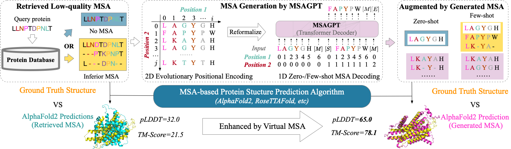
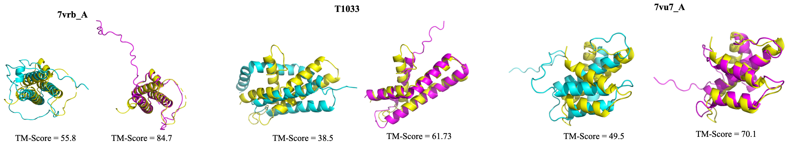
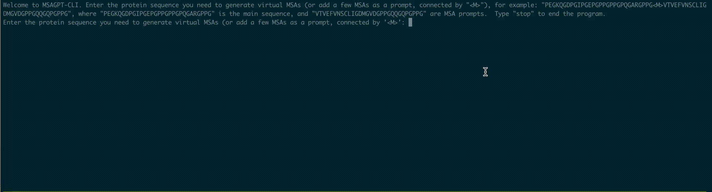

# MSAGPT

<table>
  <tr>
    <td>
      <h2>MSAGPT</h2>
      <p>📖 Paper: <a href="xxx">MSAGPT: Neural Prompting Protein Structure Prediction via MSA Generative Pre-Training</a></p>
      <p><b>MSAGPT</b> is a powerful protein language model (PLM). MSAGPT has 3 billion parameters with three versions of the model, MSAGPT, MSAGPT-Sft, and MSAGPT-Dpo, <b>supporting zero-shot and few-shot MSA generation</b>.</p>
      <p><b>MSAGPT achieves state-of-the-art structural prediction performance on natural MSA-scarce scenarios</b>.</p>
    </td>
  </tr>
</table>


## Overall Framework
<p align="center">

</p>

## Visualized Cases
Visualization of improved structure prediction compared with nature MSA.
<font color=orange>Yellow</font>: Ground truth; 
<font color=purple>Purple</font>: Predictions based on MSA generated by MSAGPT; 
<font color=cyan>Cyan</font>: Predictions from MSA generated by natural MSA.

<p align="center">

</p>


## Get Started: 

### Option 1：Deploy MSAGPT by yourself

We support GUI for model inference.

First, we need to install the dependencies.

```bash
# CUDA >= 11.8
pip install -r requirements.txt
```

#### Model List
You can choose to manually download the necessary weights. Then UNZIP it and put it into the **checkpoints** folder.

| Model            | Type | Seq Length | Download                                                                                                                                |                                                                                                                                                                                
|------------------|------|------------|-----------------------------------------------------------------------------------------------------------------------------------------|
| MSAGPT         | Base | 16K         | [🤗 Huggingface](https://cloud.tsinghua.edu.cn/f/ebfc954a4cd24cef9243/?dl=1)  [🔨 SwissArmyTransformer](https://cloud.tsinghua.edu.cn/f/ebfc954a4cd24cef9243/?dl=1)  |
| MSAGPT-SFT   | Sft | 16K        | [🤗 Huggingface](https://cloud.tsinghua.edu.cn/f/ebfc954a4cd24cef9243/?dl=1)  [🔨 SwissArmyTransformer](https://cloud.tsinghua.edu.cn/f/32da3eadf6e042aab2fa/?dl=1)   |
| MSAGPT-DPO | Rlhf | 16K         | [🤗 Huggingface](https://cloud.tsinghua.edu.cn/f/ebfc954a4cd24cef9243/?dl=1)  [🔨 SwissArmyTransformer](https://cloud.tsinghua.edu.cn/f/ebfc954a4cd24cef9243/?dl=1) |                                                                                                                                                                                      |                                                                                                                                                                                  |


#### Situation 1.1 CLI (SAT version)

Run CLI demo via:

```bash
# Online Chat
bash scripts/cli_sat.sh --from_pretrained ./checkpoints/MSAGPT-DPO --input-source chat --stream_chat --max-gen-length 1024
```

The program will automatically interact in the command line. You can generate replies entering the protein sequence you need to generate virtual MSAs (or add a few MSAs as a prompt, connected by "\<M\>"), for example: "PEGKQGDPGIPGEPGPPGPPGPQGARGPPG\<M\>VTVEFVNSCLIGDMGVDGPPGQQGQPGPPG", where "PEGKQGDPGIPGEPGPPGPPGPQGARGPPG" is the main sequence, and "VTVEFVNSCLIGDMGVDGPPGQQGQPGPPG" are MSA prompts, and pressing enter. Enter `stop` to stop the program. The chat CLI looks like:
<p align="center">

</p>


You can also enable the offline generation by set the **--input-source \<your input file\>** and **--output-path \<your output path\>**.
We set an input file example: *msa_input*. 
```bash
# Offline Generation
bash scripts/cli_sat.sh --from_pretrained ./checkpoints/MSAGPT-DPO --input-source <your input file> --output-path <your output path> --max-gen-length 1024
```

#### Situation 1.2 CLI (Huggingface version)
(TODO)

#### Situation 1.3 Web Demo
(TODO)

### Option 2：Finetuning MSAGPT

(TODO)

### Hardware requirement

* Model Inference:
  For BF16: 1 * A100(80G) 

* Finetuning:

  For BF16: 4 * A100(80G) *[Recommend]*.


## License

The code in this repository is open source under the [Apache-2.0 license](./LICENSE).

If you find our work helpful, please consider citing the our paper

```


```